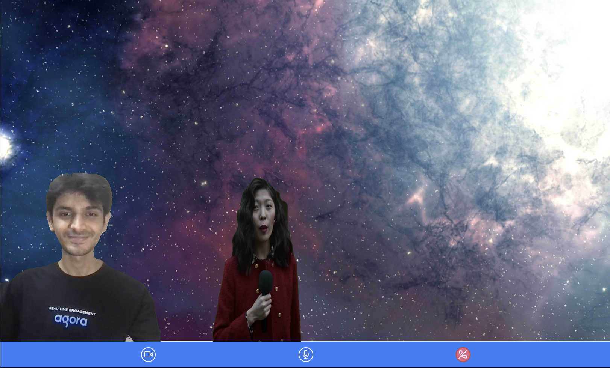

# Agora Web Watchparty

Use a Agora Extension for background removal with HTML Canvas to composite the videos on top of any media.  
This project is built with React and the [Agora Web UIKit](https://github.com/AgoraIO-Community/Web-React-UIKit/).

## How To Use
Add your Agora App ID (and channel token) to `./src/App.tsx`.  
You can start the project by executing `npm i && npm start`.  

Example:
